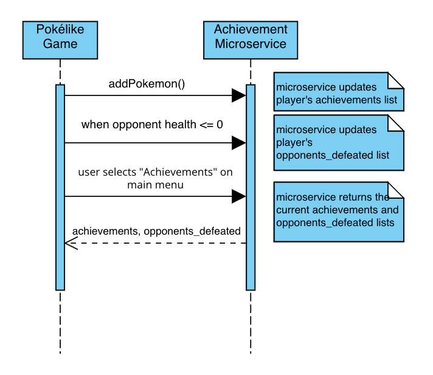

# Achievement-Microservice
This microservice is designed to handle achievements in the Pokélike game developed by Caden White.

## Communication Contract

### How to Programmatically REQUEST Data
To request data from this microservice, you can make HTTP POST requests to the following endpoints:
1. `/pokemon_added`: Used to notify the microservice when a new Pokémon is added by the player.
   * Send a JSON payload with the following structure: `{"pokemon_inventory": [Player's list of Pokémon]}`
   * Example Call:
   ```
   import requests

   url = 'http://127.0.0.1:5000/pokemon_added'
   data = {"pokemon_inventory": [{"name": "Pikachu", "level": 5}, {"name": "Charmander", "level": 7}]}
   response = requests.post(url, json=data)

   print(response.json())
   ```
2. `/battle_completed`: Used to notify the microservice when the player completes a battle.
   * Send a JSON payload with the following structure: `{"opponent_name": "Pidgeotto"}`
   * Example Call:
   ```
   import requests

   url = 'http://127.0.0.1:5000/battle_completed'
   data = {"opponent_name": "Pidgeotto"}
   response = requests.post(url, json=data)

   print(response.json())
   ```

### How to Programmatically RECEIVE Data
To receive data from this microservice, you can make an HTTP GET request to the /achievements endpoint. This endpoint returns a JSON object containing the player's achievements and opponents defeated.
* Example Call:
```
import requests

url = 'http://127.0.0.1:5000/achievements'
response = requests.get(url)

data = response.json()
print("Achievements:", data["achievements"])
print("Opponents Defeated:", data["opponents_defeated"])
```

### UML Sequence Diagram

